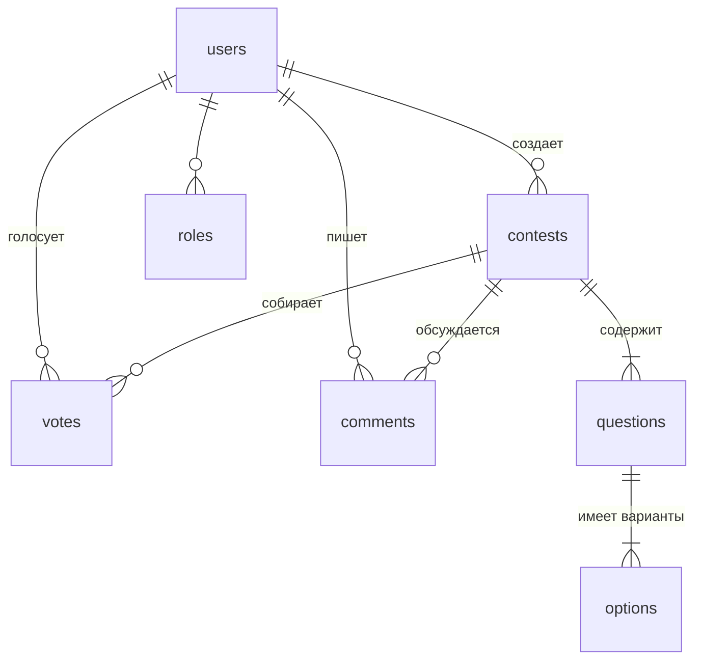

## 2. Спецификация таблиц

### 2.1. Таблица `users` (Пользователи)
Управляет учетными записями и ролями в системе.

| Поле | Тип данных | Ограничения | Описание / Назначение |
| :--- | :--- | :--- | :--- |
| `id` | BigInteger | PK, Autoincrement | Уникальный ID пользователя |
| `name` | String(255) | Not Null | Имя или никнейм |
| `email` | String(255) | Not Null, Unique | Email для входа |
| `password` | String(255) | Not Null | Хэш пароля |
| `role` | Enum | 'user', 'organizer', 'admin' | Роль доступа (по умолчанию 'user') |
| `created_at` | Timestamp | Nullable | Дата регистрации (Laravel) |
| `updated_at` | Timestamp | Nullable | Дата обновления профиля (Laravel) |

